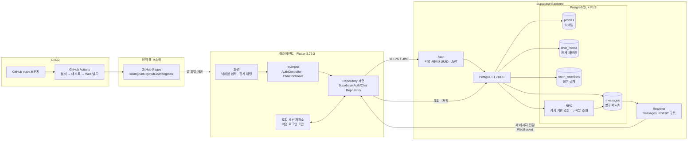
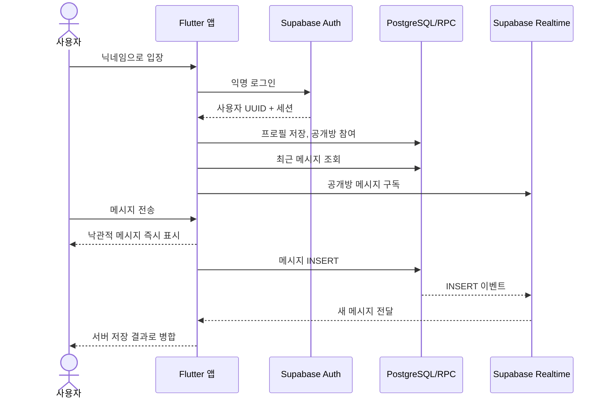
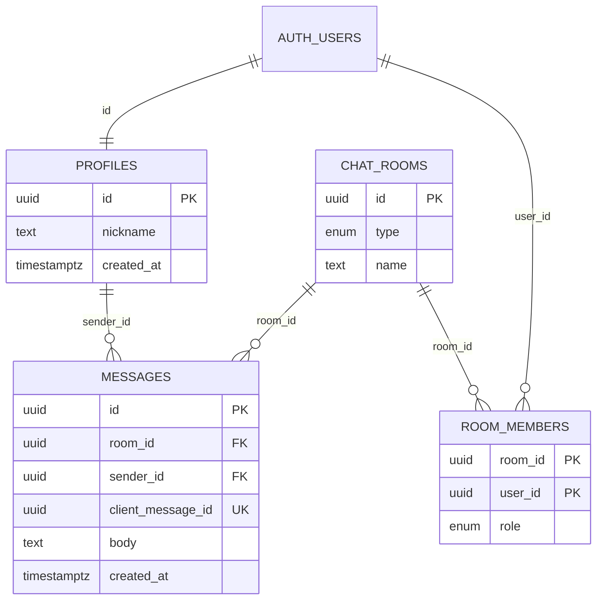

# MangoTalk 시스템 구성도

현재 구현을 기준으로 한 시스템 구성입니다. 다이어그램은 GitHub에서 바로 렌더링되는 Mermaid 형식으로 관리합니다.

## 핵심 동작 흐름

## 익명 사용자 식별

- 사용자 식별자는 닉네임이 아니라 Supabase Auth의 `auth.users.id` UUID입니다.
- 브라우저에 보존된 세션으로 새로고침 후에도 같은 UUID를 사용합니다.
- 저장소 삭제, 시크릿 모드, 다른 브라우저·기기에서는 새 익명 사용자가 생성됩니다.
- 메시지는 `messages.sender_id`로 프로필과 연결되며, 삭제하기 전까지 PostgreSQL에 남습니다.

## 데이터 관계

RLS(Row Level Security)는 인증 사용자만 데이터에 접근하게 하고, 공개방에 참여한 사용자만 메시지를 읽고 자신의 UUID로만 메시지를 보낼 수 있게 제한합니다.
